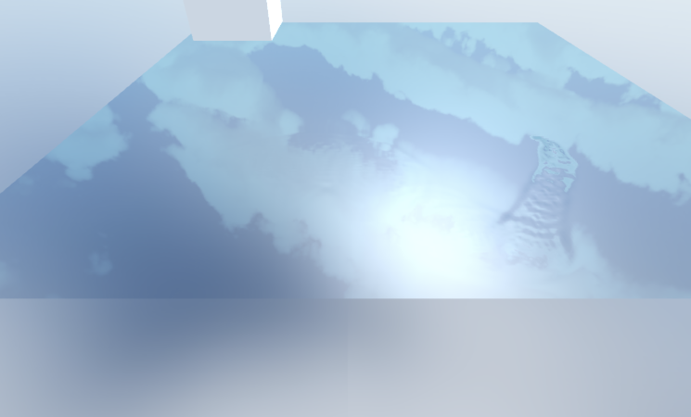

# Water simulation using height maps inside shaders in Unity:
* Implementation done with two shader programs. First shader program calculates height positions and stores them in texture. Second shader program renders in fragment shader heights of fragments based on texture.
* Reflection of skybox.
* Specular reflection of directional light.
* Interaction with water done with: mouse clicking and moving objects in water.

